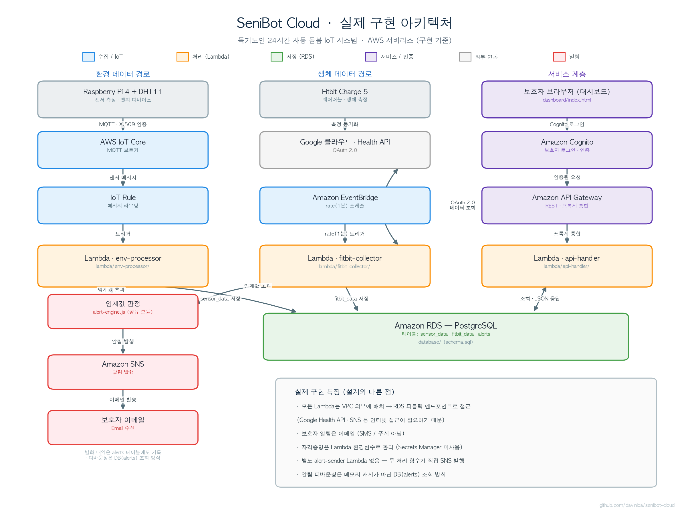

# SeniBot Cloud

독거노인을 위한 24시간 자동 돌봄 IoT 시스템 '시니봇(SeniBot)'의 AWS 클라우드 버전입니다.

어르신은 가정에 설치된 센서와 웨어러블만 착용하면 되고, 보호자는 원격에서 대시보드로 상태를 모니터링합니다. 온도·습도·심박수 등에서 위험이 자동으로 감지되면 보호자에게 즉시 알림이 전송됩니다.

이 프로젝트는 이전 단계인 On-Premise 구현([senibot-onpremise](https://github.com/davinida/senibot-onpremise))을 AWS 클라우드 환경으로 이전한 구현체입니다.

## 아키텍처

AWS 관리형 서비스 기반의 서버리스 구조입니다. 데이터는 두 갈래(환경 / 생체)로 수집되어 RDS에 저장되고, 임계값을 벗어나면 보호자에게 알림이 발송됩니다. 보호자는 Cognito 로그인 후 대시보드에서 데이터를 조회합니다.

아래는 실제 구현된 시스템 아키텍처입니다.



다음은 위 구조의 텍스트 요약입니다.

```
[ 환경 데이터 ]
  Raspberry Pi 4 + DHT11
        |  온습도 측정 → MQTT 발행
        v
  AWS IoT Core → IoT Rule → Lambda (env-processor) → RDS (sensor_data)

[ 생체 데이터 ]
  EventBridge (rate 1분 트리거)
        |
        v
  Lambda (fitbit-collector) → Google Health API (← Fitbit Charge 5 측정값)
        |  최신 생체값 수신
        v
  RDS (fitbit_data)

[ 알림 (두 Lambda 공통) ]
  임계값 초과 판정 → Amazon SNS → 보호자 이메일
                  (+ alerts 테이블에 발화 기록)

[ 서비스 (보호자 대시보드) ]
  보호자 브라우저 → Amazon Cognito 로그인 (화면 접근 제어)
  보호자 브라우저 → API Gateway → Lambda (api-handler) → RDS 조회 → JSON 응답
```

## 기술 스택

| 구분 | 사용 기술 |
|------|-----------|
| 수집(엣지) | Raspberry Pi 4 + DHT11, Fitbit Charge 5 |
| 데이터 연동 | AWS IoT Core (MQTT), Google Health API (OAuth 2.0) |
| 처리 | AWS Lambda (Node.js 22), Amazon EventBridge |
| 저장 | Amazon RDS (PostgreSQL) |
| 알림 | Amazon SNS (이메일) |
| 서비스 / 조회 | Amazon API Gateway (REST), 정적 웹 대시보드 |
| 인증 | Amazon Cognito (보호자 로그인) |

## 구현 현황

- [x] RDS PostgreSQL 구축 및 스키마 적용
- [x] 환경 데이터 수집 파이프라인 (IoT Core → Lambda → RDS)
- [x] 생체 데이터 수집 (Google Health API 실연동 → Lambda → RDS)
- [x] 임계값 기반 보호자 알림 (SNS 이메일)
- [x] 조회 REST API (API Gateway + Lambda)
- [x] 보호자 대시보드 (Cognito 로그인 포함)

## 디렉터리 구조

```
senibot-cloud/
├── database/                 # RDS 스키마(schema.sql) · 시드(seed.sql) · .env.example
├── lambda/
│   ├── env-processor/        # 환경 데이터 처리 (IoT Core → RDS) + 알림 평가
│   ├── fitbit-collector/     # 생체 데이터 수집 (Google Health API → RDS) + 알림 평가
│   ├── api-handler/          # 조회 REST API (API Gateway 프록시 → RDS)
│   ├── shared/               # 공용 알림 엔진 alert-engine.js (각 함수 폴더로 복사 배포)
│   ├── auth-handler/         # (미사용) 인증은 대시보드의 Cognito SDK로 직접 처리
│   └── alert-sender/         # (미사용) 알림은 두 처리 함수가 직접 SNS 발행
├── dashboard/                # 보호자 웹 대시보드 index.html (Cognito 로그인 + 조회 UI)
├── raspberry-pi/             # 엣지 코드 위치 (라즈베리파이에서 실행 · 저장소 미포함)
├── infra/                    # AWS 리소스 구성 메모 (실제 리소스는 콘솔에서 설정)
└── docs/                     # implementation-plan.md · architecture.png
```

> 각 Lambda는 의존성(`node_modules`)을 포함해 zip으로 묶어 업로드하므로, `node_modules`와 `*.zip`은 저장소에서 제외됩니다(`.gitignore`).

## API 엔드포인트

단일 Lambda(`api-handler`)가 API Gateway 프록시 통합으로 모든 경로를 처리합니다. 응답은 JSON이며 CORS 헤더와 UTF-8 인코딩을 포함합니다. 아래 경로는 API Gateway 베이스 URL 뒤에 붙습니다.

| 메서드 | 경로 | 설명 |
|--------|------|------|
| GET | `/api/environment/current` | 최신 환경(온습도) 1건 |
| GET | `/api/environment/history?limit=N` | 환경 이력 (limit 1~500, 기본 50, 시간 오름차순) |
| GET | `/api/fitbit/latest` | 최신 생체 데이터 1건 |
| GET | `/api/fitbit/history?limit=N` | 생체 이력 (limit 1~200, 기본 20, 시간 오름차순) |
| GET | `/api/alerts?limit=N&unacknowledged_only=true\|false` | 알림 목록 (limit 1~200, 기본 30, 시간 내림차순) |
| POST | `/api/alerts/{id}/acknowledge` | 해당 알림을 확인 처리(acknowledged=true) |
| GET | `/api/dashboard/summary` | 대시보드 요약 (어르신 상태·최신 생체·최신 환경·미확인 알림) |

## 데이터베이스 스키마

| 테이블 | 설명 | 주요 컬럼 |
|--------|------|-----------|
| `seniors` | 어르신 정보 | senior_id, name, device_id |
| `guardians` | 보호자 정보 | guardian_id, senior_id, name, phone, cognito_sub |
| `sensor_data` | 환경 센서 데이터 | senior_id, timestamp, temperature, humidity |
| `fitbit_data` | 생체 데이터 | senior_id, timestamp, heart_rate, steps, sleep_score, spo2 |
| `alerts` | 알림 이력 | senior_id, timestamp, alert_type, level, message, acknowledged |

시각 컬럼은 시간대 정합성을 위해 `TIMESTAMPTZ`를 사용하며, 최근 데이터 조회와 알림 디바운싱을 위한 인덱스가 정의되어 있습니다. 전체 DDL은 [`database/schema.sql`](database/schema.sql)을 참고하세요.

## 주요 기능

### 임계값 기반 보호자 알림

환경/생체 데이터를 규칙 기반으로 평가하여 위험 상황을 감지합니다. 임계값은 환경변수로 조정할 수 있으며, 기본값은 다음과 같습니다.

| 종류 | 조건(기본값) | 수준 |
|------|------|------|
| 실내 온도 | 35°C 초과 / 10°C 미만 | WARNING |
| 실내 습도 | 80% 초과 / 20% 미만 | INFO |
| 안정 시 심박수 | 100 bpm 초과 / 45 bpm 미만 | WARNING |
| 활동량(걸음수) | 평소 대비 현저히 낮음 | INFO |

알림 메시지는 보호자 관점의 한국어로 작성됩니다 (예: "어머니 댁 실내 온도가 위험 수준입니다 ... 안부 확인을 권장합니다."). 발송은 Amazon SNS 이메일로 이루어지며, 동시에 `alerts` 테이블에 발화 이력이 기록됩니다. 알림 판정 로직은 두 처리 Lambda가 공유하는 모듈 `lambda/shared/alert-engine.js`에 있습니다.

### 디바운싱 (중복 알림 방지)

같은 종류의 알림이 짧은 시간(기본 5분) 안에 반복 발생하면 한 번만 발송합니다. `alerts` 테이블 조회로 직전 발화 시각을 확인하여, 동일한 경보가 보호자에게 반복 전송되는 것을 방지합니다.

### 생체 데이터 중복 저장 방지

주기적으로 실행되는 생체 수집 Lambda가 같은 측정 시각의 데이터를 중복 저장하지 않도록, 직전 저장값의 측정 시각과 비교해 동일하면 저장을 건너뜁니다.

### 보호자 대시보드

정적 웹 페이지(`dashboard/index.html`)로, Amazon Cognito 로그인을 통과해야 화면에 접근할 수 있습니다. 로그인 후 어르신 상태 배너, 실시간 데이터 카드(온도·습도·심박수·걸음수), 온도 추이 그래프, 미확인 알림 목록과 확인 버튼을 제공하며 5초 간격으로 자동 갱신됩니다.

## 빌드 / 배포

1. **데이터베이스** — `database/.env.example`를 복사해 `.env`를 만들고 RDS 접속 정보를 채운 뒤, `schema.sql`로 테이블·인덱스를 생성하고 `seed.sql`로 초기 데이터를 적재합니다.
2. **Lambda 함수** — 각 함수 폴더에서 `npm install` 후 폴더 내용을 zip으로 묶어 업로드합니다(런타임 Node.js 22, 핸들러 `index.handler`). `alert-engine.js`는 `lambda/shared/`의 원본을 `env-processor`·`fitbit-collector`로 복사해 함께 배포합니다. 세 Lambda는 모두 VPC 외부에 두고 접속 정보를 환경변수로 주입합니다.
3. **IoT Core** — 사물(Thing)·X.509 인증서·정책을 만들고, IoT Rule이 센서 메시지를 `env-processor`로 라우팅하도록 설정합니다.
4. **EventBridge** — `rate(1 minute)` 규칙으로 `fitbit-collector`를 주기 실행합니다.
5. **SNS** — 토픽을 만들고 보호자 이메일을 구독(확인)한 뒤, Lambda 실행 역할에 `sns:Publish` 권한을 부여합니다.
6. **API Gateway** — `/{proxy+}` 리소스의 ANY 메서드를 `api-handler`에 Lambda 프록시 통합으로 연결합니다.
7. **Cognito** — 사용자 풀과 앱 클라이언트(SPA)를 만들고, 풀/클라이언트 ID를 대시보드 설정에 입력합니다.
8. **대시보드** — `dashboard/index.html`을 S3 정적 호스팅(또는 로컬)에서 제공하고, API Gateway 베이스 URL을 설정합니다.

## 환경 변수 / 보안

이 저장소는 공개되어 있어 **자격증명과 접속 정보를 일절 포함하지 않습니다.** 모든 민감정보는 코드에 하드코딩하지 않고 환경변수 등으로 주입합니다.

| 구성 요소 | 환경변수 (값은 미포함) |
|-----------|------------------------|
| 공통 (env-processor · fitbit-collector · api-handler) | `DB_HOST`, `DB_PORT`, `DB_NAME`, `DB_USER`, `DB_PASSWORD` |
| fitbit-collector (Google 연동) | `GOOGLE_CLIENT_ID`, `GOOGLE_CLIENT_SECRET`, `GOOGLE_REFRESH_TOKEN` |
| 알림 (env-processor · fitbit-collector) | `SNS_TOPIC_ARN`, (선택) `*_THRESHOLD`, `ALERT_DEBOUNCE_SEC`, `FITBIT_SEED_STEPS` |
| 대시보드 (클라이언트) | Cognito 사용자 풀 ID · 앱 클라이언트 ID, API Gateway 베이스 URL |

- DB 접속 정보, Google OAuth 자격증명 등은 **Lambda 환경변수**로 주입합니다.
- IoT 디바이스 인증서·키, `.env` 파일은 저장소에 커밋하지 않습니다(`.gitignore` 처리).
- RDS 엔드포인트, SNS 토픽 ARN, 계정 식별자 등 인프라 식별 정보는 README/코드에 포함하지 않으며, AWS 콘솔에서 관리합니다.
